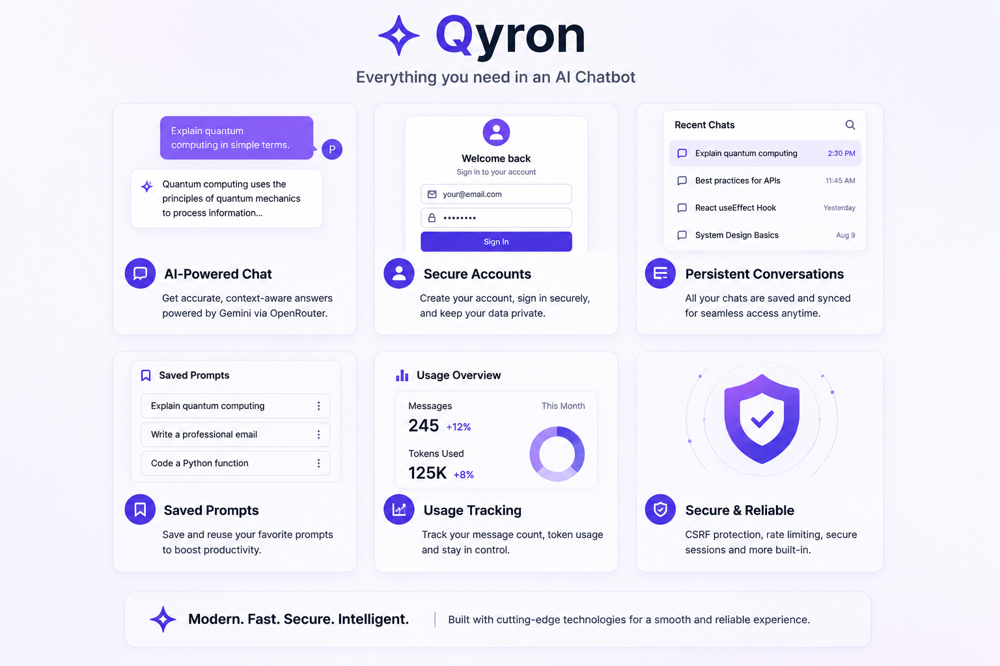

# Qyron

Qyron is a production-ready, full-stack AI chat application featuring persistent conversation threads, secure cookie-based user authentication, and Gemini-powered intelligence served via OpenRouter. Built with a modern glassmorphism Material Design 3 interface, it delivers a sleek, responsive workspace for seamless AI interaction.

---

## Preview


*Qyron's glassmorphism interface featuring conversation threads, category quick-prompts, and dark/light themes.*

---

## What I Built

Qyron is designed as a complete, full-stack AI chat environment that pairs modern frontend aesthetics with enterprise-grade backend security:

- **AI-Powered Chat**: Server-side streaming communication with Gemini models via OpenRouter.
- **Persistent Conversations**: Complete history management with thread creation, search, rename, archive, and deletion.
- **User Authentication**: Secure account registration, login, multi-session management, and password reset flows.
- **Saved Prompts**: Custom prompt library management for quick workflow execution.
- **User Settings & Preferences**: Per-user theme preferences (light/dark) persisted across devices.
- **Usage Tracking**: Detailed dashboard tracking API calls and usage stats over customizable timeframes.
- **Security Controls**: Server-side key protection, rate limiting, CSRF double-submit cookies, and Argon2id password hashing.
- **Responsive UI**: Material Design 3 UI with smooth transitions and glassmorphism styling across mobile and desktop.

---

## Architecture


### System Flow
`User` → `React Frontend (Vite)` → `FastAPI Backend (Async SQLAlchemy)` → `PostgreSQL / OpenRouter` → `Gemini`

- **Frontend**: Built with React 19, Vite, and Tailwind CSS. It communicates with the backend via REST endpoints and handles local UI state, authentication context, and theme settings.
- **Backend**: Asynchronous Python FastAPI application using SQLAlchemy with `asyncpg` / `aiosqlite`. It manages session validation, rate limiting, database interactions, and OpenRouter API integration.
- **Database**: Relational schema supporting PostgreSQL in production (Render) and SQLite for local development.
- **AI Integration**: OpenRouter API proxying Google Gemini models with all API keys kept strictly server-side.
- **Deployment**: Static frontend hosted on Netlify; web service hosted on Render with managed PostgreSQL.

---

## Key Features



- **AI-Powered Messaging**: Intelligent multi-turn chat interactions with live streaming support and edit/retry capability.
- **Secure Authentication**: Cookie-backed HTTP-only sessions with Argon2id password hashing and session revocation.
- **Persistent Chat History**: Full conversation management including full-text search, archiving, and automatic titling.
- **Saved Prompt Library**: User-curated prompt templates for rapid reuse.
- **Usage Analytics**: Real-time tracking of message counts and daily usage limits per user.
- **Customizable Preferences**: Light and dark theme toggles synced with user settings backend.
- **Layered Rate Limiting**: Multi-tiered throttling (per-minute, daily, auth window, and IP-level) to protect backend services.
- **Responsive Workspace**: Seamless Material Design 3 layout adapted for both desktop and mobile screens.

---

## By the Numbers

- **9** Async Database Models (`User`, `UserSession`, `Conversation`, `Message`, `SavedPrompt`, `UserSettings`, `PasswordReset`, `EmailVerification`, `UsageLog`)
- **6** API Router Modules (`auth`, `chat`, `conversations`, `saved-prompts`, `settings`, `usage`)
- **29** Implemented REST API Endpoints
- **10** Authentication & Account Security Operations

---

## Tech Stack

| Layer | Technology |
|---|---|
| **Frontend** | React 19, Vite, Tailwind CSS |
| **Backend** | Python 3.11+, FastAPI, SQLAlchemy (async) |
| **Database** | PostgreSQL (Production) / SQLite (Development) |
| **AI** | OpenRouter / Gemini |
| **Deployment** | Netlify / Render |

---

## Technical Decisions

1. **FastAPI for Async I/O**:
   - *Choice*: FastAPI with Python `asyncio` and `asyncpg` / `aiosqlite`.
   - *Rationale*: Non-blocking asynchronous handlers allow efficient handling of high-concurrency requests and AI API proxying without thread bloat.
   - *Trade-off*: Requires async-compatible drivers and careful context management across database sessions.

2. **Server-Side AI API Key Management**:
   - *Choice*: OpenRouter API integration strictly encapsulated within backend service routes.
   - *Rationale*: Prevents exposing private API keys or tokens to client-side code, allowing centralized rate limiting and usage quotas.
   - *Trade-off*: Increases backend workload as all AI message traffic must proxy through the FastAPI server.

3. **Cookie-Based Session Authentication with Double-Submit CSRF**:
   - *Choice*: Server-side hashed session tokens stored in `HttpOnly`, `Secure`, `SameSite` cookies alongside a CSRF token header check.
   - *Rationale*: Protects tokens from XSS script access while mitigating cross-site request forgery without requiring local storage management.
   - *Trade-off*: Requires explicit CORS credentials configuration and secure cookie handling across separate frontend and backend domains.

4. **Dual Database Architecture (SQLite / PostgreSQL)**:
   - *Choice*: SQLAlchemy ORM abstraction supporting SQLite for local dev and PostgreSQL for production.
   - *Rationale*: Enables rapid zero-dependency local development while deploying to a high-concurrency relational database in production.
   - *Trade-off*: Database migrations and column types must remain compatible across both SQL dialects.

---

## Security

- **Password Security**: Passwords hashed using Argon2id with unique salts.
- **Session Management**: Session tokens stored server-side with `HttpOnly`, `Secure`, and `SameSite` attributes.
- **CSRF Protection**: Double-submit cookie pattern verified on state-changing requests.
- **Rate Limiting**: Multi-tiered protection against brute-force and resource exhaustion (auth endpoints, per-minute, and daily caps).
- **Security Headers**: Content Security Policy (CSP), `X-Frame-Options`, `X-Content-Type-Options`, and `Referrer-Policy` enabled.
- **Input Validation**: Strict request schema validation via Pydantic models.
- **API Key Isolation**: OpenRouter credentials remain isolated in server environment variables.

---

## Run Locally

### Prerequisites
- Python 3.11+
- Node.js 18+

### Backend Setup

```bash
cd backend
python -m venv venv

# Windows:
venv\Scripts\activate
# macOS/Linux:
source venv/bin/activate

cp .env.example .env
# Configure OPENROUTER_API_KEY and SESSION_SECRET in .env

pip install -r requirements.txt
uvicorn app.main:app --reload --port 8000
```

### Frontend Setup

```bash
cd frontend
npm install
npm run dev
```

The frontend app runs locally at `http://localhost:5173` and proxies API requests to `http://localhost:8000`.

---

## Deployment

- **Frontend (Netlify)**: Set Base directory to `frontend`, Build command to `npm run build`, and Publish directory to `dist`. Set `VITE_API_URL` to your production backend URL.
- **Backend (Render)**: Set Root directory to `backend` and set environment variables as detailed in `backend/.env.example`.
