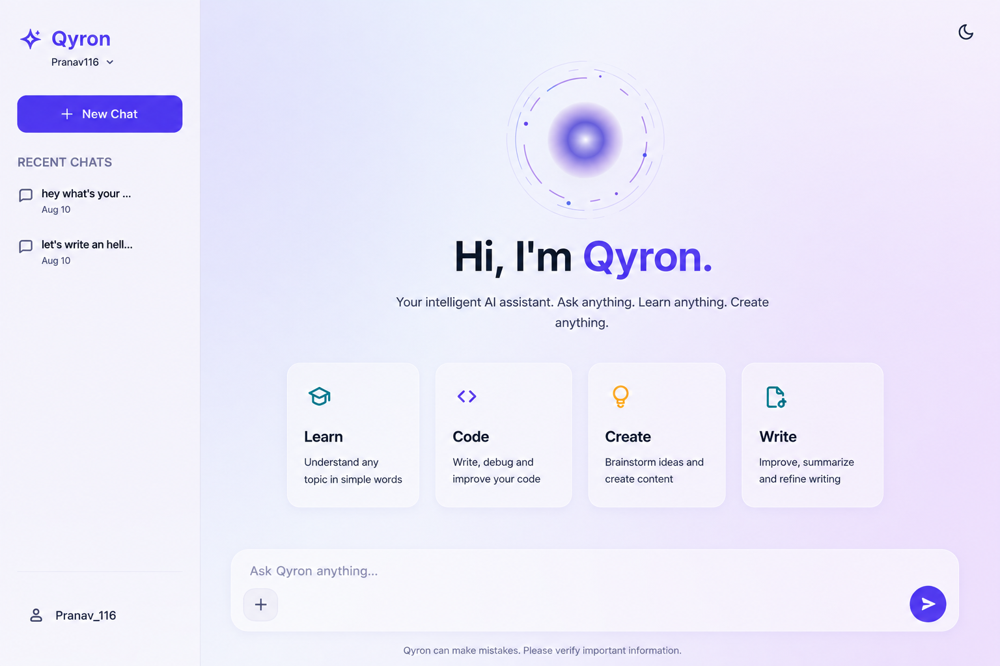
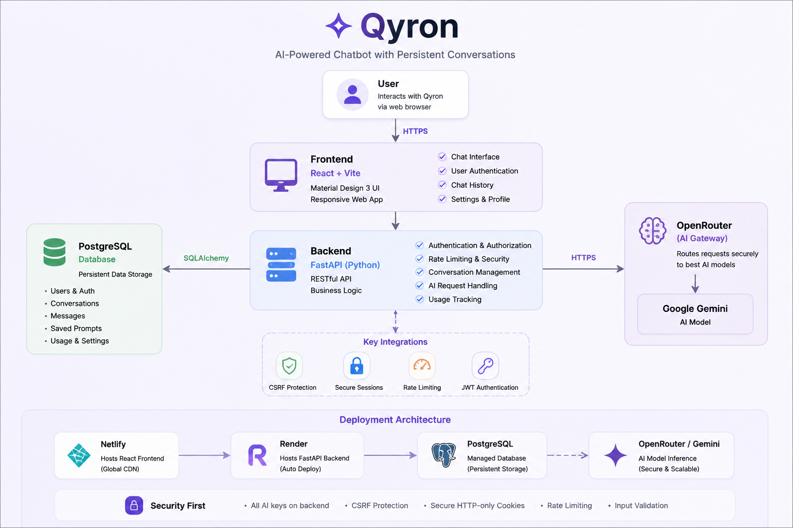

# Qyron

Qyron is a full-stack AI chat application featuring persistent conversation threads, JWT-based user authentication, and Gemini-powered intelligence served via OpenRouter. Built with a modern glassmorphism Material Design 3 interface, it delivers a sleek, responsive workspace for seamless AI interaction.

---

## Preview



*Qyron's glassmorphism interface featuring conversation threads, category quick-prompts, and dark/light themes.*

---

## What I Built

Qyron is designed as a complete, full-stack AI chat environment that pairs modern frontend aesthetics with backend security:

- **AI-Powered Chat**: Server-side communication with Gemini models via OpenRouter.
- **Persistent Conversations**: Complete history management with thread creation, search, rename, archive, and deletion.
- **User Authentication**: Secure account registration and login using JWT tokens with bcrypt password hashing.
- **User Isolation**: Each user can only access their own conversations - complete data isolation.
- **Responsive UI**: Material Design 3 UI with smooth transitions and glassmorphism styling across mobile and desktop.

---

## Architecture



### System Flow

```
User
  ↓
Netlify (React + Vite SPA)
  ↓ HTTPS API
Render (FastAPI Backend)
  ↓              ↓
PostgreSQL    OpenRouter
                ↓
              Gemini
```

- **Frontend**: Built with React 18, Vite, and Tailwind CSS. Communicates with the backend via REST endpoints with JWT authentication.
- **Backend**: Asynchronous Python FastAPI application using SQLAlchemy. Manages authentication, rate limiting, database interactions, and OpenRouter API integration.
- **Database**: PostgreSQL in production (Render), SQLite for local development.
- **AI Integration**: OpenRouter API proxying Google Gemini models with all API keys kept strictly server-side.
- **Deployment**: Static frontend hosted on Netlify; web service hosted on Render with managed PostgreSQL.

---

## Tech Stack

| Layer | Technology |
|---|---|
| **Frontend** | React 18, Vite, Tailwind CSS |
| **Backend** | Python 3.11+, FastAPI, SQLAlchemy (async) |
| **Database** | PostgreSQL (Production) / SQLite (Development) |
| **Auth** | JWT (python-jose), bcrypt password hashing |
| **AI** | OpenRouter / Gemini |
| **Deployment** | Netlify / Render |

---

## Security

- **Password Security**: Passwords hashed using bcrypt with automatic salting.
- **JWT Authentication**: Stateless token-based authentication with configurable expiry.
- **User Isolation**: Every conversation is scoped to its owner - users cannot access other users' data.
- **Server-Side API Key**: OpenRouter credentials remain isolated in server environment variables.
- **Rate Limiting**: Per-IP global rate limiting plus chat-specific rate limiting.
- **Security Headers**: CSP, X-Frame-Options, X-Content-Type-Options, Referrer-Policy, HSTS.
- **CORS**: Restricted to configured frontend origins only.
- **Input Validation**: Strict request schema validation via Pydantic models.

---

## Run Locally

### Prerequisites
- Python 3.11+
- Node.js 18+

### Backend Setup

```bash
cd backend
python -m venv venv

# Windows:
venv\Scripts\activate
# macOS/Linux:
source venv/bin/activate

cp .env.example .env
# Configure OPENROUTER_API_KEY and JWT_SECRET in .env

pip install -r requirements.txt
uvicorn app.main:app --reload --port 8000
```

### Frontend Setup

```bash
cd frontend
npm install
npm run dev
```

The frontend app runs locally at `http://localhost:5173` and proxies API requests to `http://localhost:8000`.

---

## Environment Variables

### Backend

| Variable | Description | Default |
|---|---|---|
| `OPENROUTER_API_KEY` | Required. Your OpenRouter API key | - |
| `OPENROUTER_MODEL` | AI model to use | `google/gemini-2.0-flash-001` |
| `FRONTEND_URL` | Frontend URL for CORS | `http://localhost:5173` |
| `DATABASE_URL` | Database connection string | `sqlite+aiosqlite:///./qyron.db` |
| `JWT_SECRET` | Secret for JWT tokens | `dev-secret-change-in-production` |
| `ENVIRONMENT` | `development` or `production` | `development` |
| `GLOBAL_RATE_LIMIT_PER_MINUTE` | Global rate limit | `120` |
| `CHAT_RATE_LIMIT_PER_MINUTE` | Chat endpoint rate limit | `20` |
| `JWT_EXPIRY_MINUTES` | Token expiry in minutes | `10080` (7 days) |

### Frontend

| Variable | Description | Default |
|---|---|---|
| `VITE_API_URL` | Backend API URL | `http://localhost:8000` |

---

## Deployment

- **Frontend (Netlify)**: Set Base directory to `frontend`, Build command to `npm run build`, and Publish directory to `dist`. Set `VITE_API_URL` to your production backend URL in the Netlify dashboard.
- **Backend (Render)**: Set Root directory to `backend` and set environment variables as detailed in `backend/.env.example`. Render can auto-generate `JWT_SECRET`.

For detailed deployment instructions, see [docs/DEPLOYMENT.md](docs/DEPLOYMENT.md).

---

## API Endpoints

| Method | Endpoint | Auth | Description |
|---|---|---|---|
| `GET` | `/health` | No | Health check |
| `POST` | `/api/auth/register` | No | Create account |
| `POST` | `/api/auth/login` | No | Sign in |
| `GET` | `/api/auth/me` | Yes | Get current user |
| `POST` | `/api/chat` | Yes | Send messages to AI |
| `GET` | `/api/conversations` | Yes | List conversations |
| `GET` | `/api/conversations/archived` | Yes | List archived |
| `GET` | `/api/conversations/search` | Yes | Search by title |
| `GET` | `/api/conversations/{id}` | Yes | Get conversation detail |
| `POST` | `/api/conversations` | Yes | Create conversation |
| `PUT` | `/api/conversations/{id}` | Yes | Rename conversation |
| `POST` | `/api/conversations/{id}/archive` | Yes | Archive |
| `POST` | `/api/conversations/{id}/unarchive` | Yes | Unarchive |
| `DELETE` | `/api/conversations/{id}` | Yes | Delete conversation |

---

## Live Demo

https://qyronai.netlify.app/
